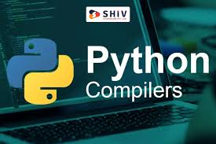

# Clase IA 

## 🏴‍☠️ Comandos consola
### 
git
```
python -- version
git --version
```
### 
## Comandos de Git
```
python --version
git --version
git init
git add .
git commit -m "IABOTCAMP v1"
```
## Comandos de GitHub
```
git branch -M main
git remote add origin https://github.com/joferdi06-dotcom/IABOTCAMP.git

```
## Fin del Programa
### 
```
python -- version
git --version
```